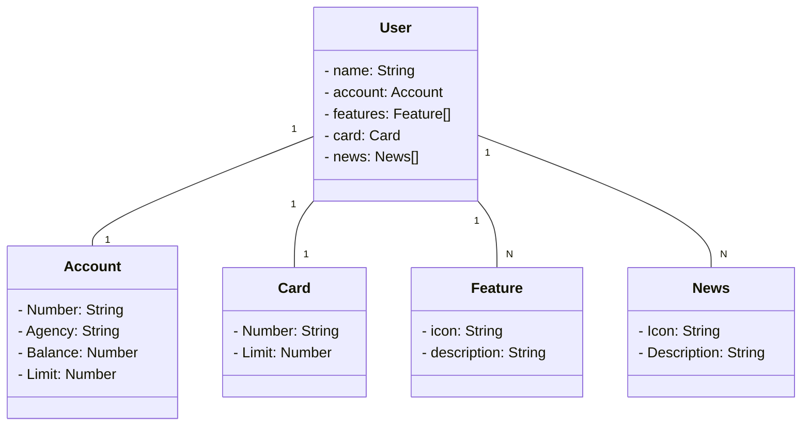

# Santander BootCamp 2023
Java RESTful API criada para o Santander Bootcamp Full Stack.

## Diagrama de Classes

```mermaid
classDiagram
    class User {
        - name: String
        - account: Account
        - features: Feature[]
        - card: Card
        - news: News[]
    }
    class Account {
        - Number: String
        - Agency: String
        - Balance: Number
        - Limit: Number
    }
    class Feature {
        - icon: String
        - description: String
    }
    class Card {
        - Number: String
        - Limit: Number
    }
    class News {
        - Icon: String
        - Description: String
    }

    User "1" -- "1" Account
    User "1" -- "1" Card
    User "1" -- "N" Feature
    User "1" -- "N" News
```
